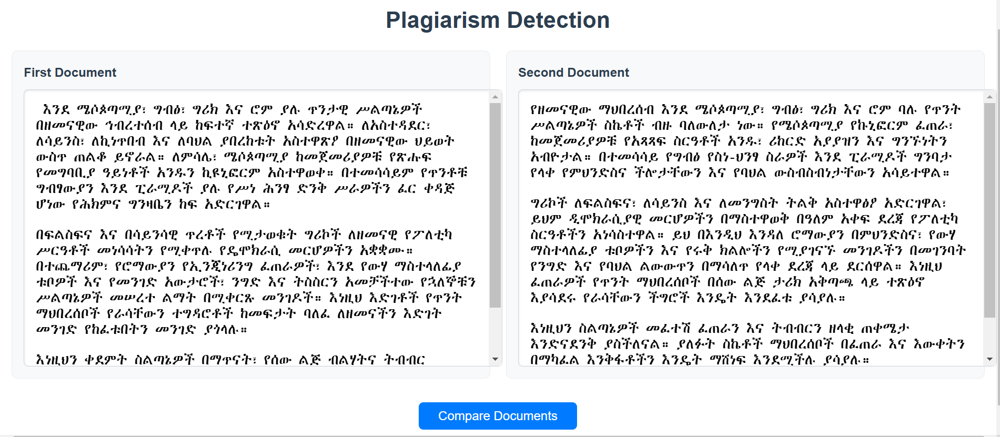
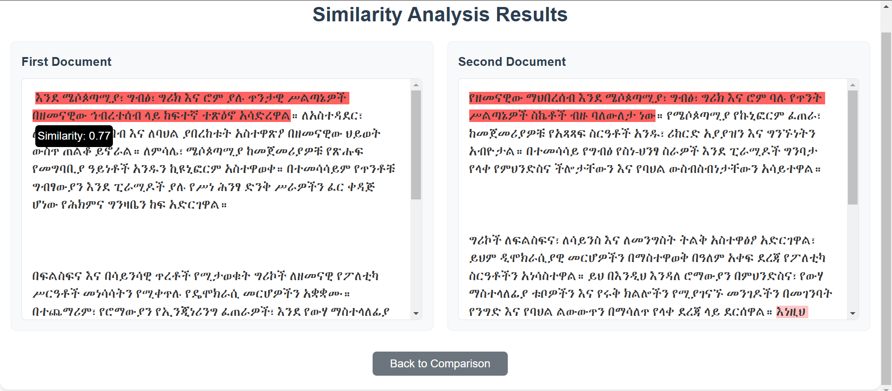

# Plagiarism Detection for Amharic text





This project implements a plagiarism detection system for the Amharic language using the **Doc2Vec** model. It provides a pipeline for data preprocessing, model training, and similarity computation, which serves as the foundation for a FastAPI server.

## Workflow

### 1. **Data Preprocessing**
   - Raw text is cleaned to prepare it for training and inference.
   - Stopwords are removed, and unnecessary characters are filtered out.
   - Text data is tokenized and transformed into a format suitable for the **Doc2Vec** model.

### 2. **Model Training**
   - The **Doc2Vec** model is trained on the preprocessed text data using Gensim.
   - Trained embeddings are saved for use in inference tasks.

### 3. **Similarity Computation**
   - The trained **Doc2Vec** model is used to calculate document similarities.
   - Cosine similarity is computed between the vectors of input documents.
   - The system identifies plagiarized sections by comparing sentences or text segments.

You can access the model weights at [here.](https://drive.google.com/file/d/1R9ULenBDBslRwdpsMbfdsiBLobcfxYIO/view?usp=sharing)

## Running the server

1. Clone the repository:

   ```bash
   git clone https://github.com/Isa1asN/plagiarism-detector.git
   cd plagiarism-detector
   ```

2. Create a new conda environment and activate it:

> [!TIP]
> Install [miniconda](https://docs.anaconda.com/miniconda/) if you don't have it
already!

   ```bash
   conda create --name plagiarism-detector python=3.10
   conda activate plagiarism-detector
   ```

3. Install dependencies:

   ```bash
   pip install -r reqs.txt
   ```

4. Download the model files zip file, unzip it and put them in 'models' folder at the root of the project.
   You can download it [here.](https://drive.google.com/file/d/1R9ULenBDBslRwdpsMbfdsiBLobcfxYIO/view?usp=sharing)

5. Run the server:

   ```bash
   cd app
   python -m main
   ```

5. Access the UI at [http://localhost:8008](http://localhost:8008)
